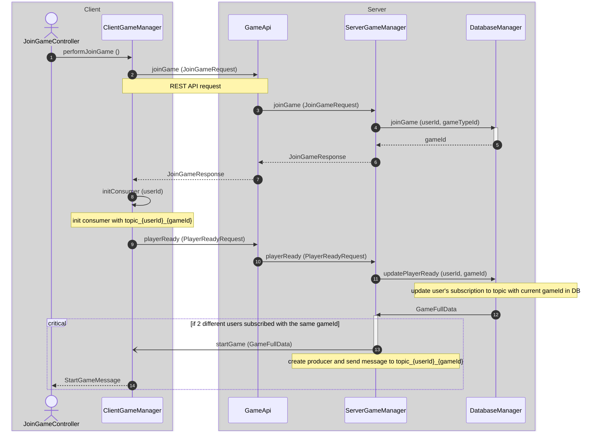

Board Games App - Battleship & Connect 4
===========================================

Board games implementation in **Java** for Battleship and Connect 4, designated for two players with game results tracking.
<br>

### Server side:
* RESTful server using **Glassfish application server**
* Receiving and handling incoming **REST API** requests
* Sending messages to a **JMS destination** managed by the **OpenMQ broker** 
* Communicating with the **PostgreSQL** database using **JDBC** connections  
  
### Client side:
* Sending REST API requests through standard HTTP methods
* Receiving messages from a JMS destination
* Providing a UI using **JavaFX** platform

&nbsp;


&nbsp;
  
------------------------------------------------

- [Usage Display](#usage-display)
  - [Creating a Member Account](#creating-a-member-account)
  - [System Options for Logged In User](#system-options-for-logged-in-user)
  - [Battleship Game](#battleship-game)  
  - [Connect 4 Game](#connect-4-game)
  - [Game Results Tracking](#game-results-tracking) 
- [Installation](#installation)
  - [Installation Requirements](#installation-requirements)
  - [Installation Instructions](#installation-instructions)
- [Server URL Configuration](#server-url-configuration)
- [Join Game Documentation](#join-game-documentation)  

**********************************************************

Usage Display
-------------
### Creating a Member Account


### System Options for Logged In User


### Battleship Game 


### Connect 4 Game 


### Game Results Tracking 

<br><br>
*******

Installation
-------------
### Installation Requirements

1) JDK 1.8 version 8.0.202 <br>https://www.oracle.com/il-en/java/technologies/javase/javase8-archive-downloads.html

2) Glassfish 5.0.0 <br>http://download.oracle.com/glassfish/5.0.1/release/java_ee_sdk-8u1.zip	

3) PostgreSQL 14 <br>https://www.enterprisedb.com/downloads/postgres-postgresql-downloads

4) PostgreSQL JDBC Driver 42.4.0 <br>https://jdbc.postgresql.org/download/

5) InteliJ ultimate <br>https://www.jetbrains.com/idea/download/#section=windows

6) Launch4j (optional) - used for creating an exe file to run the client, not from IntelliJ <br>https://sourceforge.net/projects/launch4j/files/launch4j-3/3.14/<br>

► *This application was tested in 1920×1080 display resolution in Windows.* 
<br><br>

<hr style="border: 0.1px solid lightgray;">
<br>

### Installation Instructions
&nbsp;&nbsp;
#### 1. Set Postgers properties
- Set password to ___password___
- Set username to ___postgres___ (default)
- Set port to ___5432___ (default)
<br><br>
  
#### 2. Unpack Glassfish to C drive 
<br>

#### 3. Enable connection to the database
&nbsp;&nbsp;&nbsp;&nbsp;Copy JDBC driver jar file to *`c:\glassfish5\glassfish\domains\domain1\lib\`*
<br><br>

#### 4. Update Glassfish Server Configurations
&nbsp;&nbsp;&nbsp;&nbsp;Overwrite [domain.xml](domain.xml) to _`c:\glassfish5\glassfish\domains\domain1\config\`_
<br><br>

#### 5. Import project in InteliJ and build it
&nbsp;&nbsp;&nbsp;&nbsp;If you have an error _"Application Server 'GlassFish 5.0.1' is not configured"_ in run/debug configurations:<br>
&nbsp;&nbsp;&nbsp;&nbsp;press configure and then add your GlassFish Home directory.<br>
<br>

#### 6. Deploy server
- Deploy server from InteliJ by running ___ServerApp___ run configuration
- Deploy server from cmd (only after it was deployed at least once by IntelliJ):
    - Run `asadmin start-domain` in your command line from _`C:\glassfish5\glassfish\bin`_
    - Go to `localhost:4848` in your web browser, select Applications and then on ___BoardGamesServer-v1___ row select ___Launch___
<br>

#### 7. Deploy client
- Deploy client from InteliJ by running ___ClientApp___ run configuration
- Deploy client from cmd:
  - Build artifact clientJavaFXApp
  - You can use Launch4j to create exe file to run the client:
    - Define Output file and Jar
    - Define Min and Max JRE version
    - Select the settings icon for creating the exe
<br><br>
*******
<br>

Server URL Configuration
--------------
* If the server and the client aren't running in the same machine, the following screen will appear: <br><br>
  <br><br>
 There is a screen message for updating your server URL. All the text fields and buttons are disabled, except the "Settings" button. <br>
 
* Enter "Settings" will get you to the following screen: </br></br>
  <br><br>
 As a default, the server URL is set to localhost. Update your server name or address in server URL and press "Save". <br><br>
 You can get your server address by running `ipconfig` in your *command line*. <br>
 If the server and client are connected to the same Wi-Fi network, retrieve your server's address from the ***IPv4 Address*** field under the ***Wireless LAN adapter Wi-Fi*** section.<br><br>


<!--
     If you're not registered, enter "Sign up" to create your own account: <br><br>
      <br> 

      If one of the details provided isn't correct (missing or too long input) or if the username provided already exists in the system, you'll get a screen message.
     
-->

<br>

*******
<br>

Join Game Documentation
--------------------------
Joining a game triggers the core functionalities on both the client and server sides. 
<br>
This documentation illustrates the primary workflow through the use of a sequence diagram accompanied by detailed explanations:
&nbsp;



&nbsp;&nbsp;

1. When the user presses the "Request to join a new game" button, it triggers an ActionEvent:
   
   ```java
    @FXML
    public void joinGameButtonPressed(ActionEvent ignoredEvent) {
        clientContext.changeScene("join-game.fxml");
    }
   ```
   &nbsp;&nbsp;


   Therefore, [JoinGameController](BoardGames/BoardGamesClient/src/main/java/client/controllers/JoinGameController.java) is loaded from [ClientContext](BoardGames/BoardGamesClient/src/main/java/client/ClientContext.java):
   
    ```java
       FXMLLoader loader = new FXMLLoader(getClass().getResource(fxmlFile));
       root = loader.load();
       BaseController controller = loader.getController();
       controller.postInit(this);  // pass the context to the next controller
    ```

    &nbsp;&nbsp;
     _performJoinGame()_ runs in a separate thread from _postInit_.

&nbsp;&nbsp;

 2. [ClientGameManager](BoardGames/BoardGamesClient/src/main/java/client/ClientGameManager.java) creates a `REST API` request using the HTTP POST method and sends it to the server for further processing:
    
    ```java
    Jsonb jsonb = JsonbBuilder.create();
    HttpResponse<String> apiResponse = Unirest.post(getUrl(/join-game))  // API endpoint usage
            .header("Content-Type", "application/json")
            .body(jsonb.toJson(input))
            .asString();
    ```

&nbsp;&nbsp;

3. [GameApi](BoardGames/BoardGamesServer/src/main/java/com/example/boardgamesserver/GameApi.java) defines the REST API POST method:
   
    ```java
      @POST
      @Path(/join-game)  // API endpoint declaration
      @Produces("application/json")
      @Consumes("application/json")
      public JoinGameResponse joinGame(JoinGameRequest input) {
        try {
            IServerGameManager gameManager = ServerGameManager.getInstance();
            return gameManager.joinGame(input);
        }
        catch (GeneralErrorException e) {
            throw new InternalServerErrorException(e);
        }
     }
    ```

&nbsp;&nbsp;
   
4. [DatabaseManager](BoardGames/BoardGamesServer/src/main/java/com/example/boardgamesserver/db/DatabaseManager.java) uses _gameTypeId_ and _userId_ from _JoinGameRequest_ as parameters in the SQL statement, to verify if a new game has been created for the current user in the database:
   
   ```java
        String sql = "SELECT g.game_id FROM game g JOIN user_game u ON g.game_id = u.game_id " +
                "WHERE game_type_id = ? AND status = 'WAIT_FOR_ALL_PLAYERS' AND u.user_id <> ? LIMIT 1";
   ```
   A `JDBC connection` is established to execute the query and obtain a result set.
   &nbsp;&nbsp;
   
   If the result is empty, indicating that no other user is waiting for the current game type, a new game will be created in the database.
   &nbsp;&nbsp;
   
   Otherwise, the game status will transition from _'WAIT_FOR_ALL_PLAYERS'_ to _'READY_TO_START'_.

&nbsp;&nbsp;

5. [ClientGameManager](BoardGames/BoardGamesClient/src/main/java/client/ClientGameManager.java) retrieves _gameId_ from _JoinGameResponse_ and runs _initConsumer (gameId)_.
&nbsp;&nbsp;

    `JMSContext` context is used to create a `JMSConsumer` _gameConsumer_, subscribed to a `Topic` destination named *topic_{gameId}_{userId}*.
   
      ```java
      String topicName = "topic" + this.gameId + "_" + userId;
      Topic topic = this.context.createTopic(topicName);
      this.gameConsumer = this.context.createConsumer(topic);
      ```
&nbsp;&nbsp;


6. _ClientGameManager_ creates another REST API request by running _playerReady (PlayerReadyRequest)_.
   &nbsp;&nbsp;

   [DatabaseManager](BoardGames/BoardGamesServer/src/main/java/com/example/boardgamesserver/db/DatabaseManager.java) uses _userId_ and _gameId_ from _PlayerReadyRequest_ as parameters in the SQL statement, to update user's subscription status to the topic in the database:
   
   ```java
        String sql = "UPDATE user_game SET is_ready = TRUE WHERE user_id = ? AND game_id = ?";
   ```
   &nbsp;&nbsp;
   
   Therefore, we allow user to play multiple games simultaneously, so he can create a new topic with different gameId for every game.

&nbsp;&nbsp;


7. If two different users updated their subscription with the same _gameId_ in DB,  [ServerGameManager](BoardGames/BoardGamesServer/src/main/java/com/example/boardgamesserver/managers/ServerGameManager.java) runs _startGame (GameFullData)_.

     Therefore, `JMSProducer` created in server. Now the server can interact with the clients by sending messages to *topic_{gameId}_{userId}*:
   
     ```java
        String topicName = "topic" + gameId + "_" + userId;
        Topic topic = this.context.createTopic(topicName);
        this.context.createProducer().send(topic, gameMessage);
     ```

     [StartGameMessage](BoardGames/common/src/main/java/common/StartGameMessage.java) is sent back to the client.
   
&nbsp;&nbsp;

<!--
*****************

Features
-------------

- **Simultaneous Multi-Game Play:**
  Users can enjoy the flexibility of playing multiple games simultaneously, managing and switching between game sessions seamlessly, as explained in section 6 in [Join Game Documentation](#join-game-documentation)
  
- **Automatic Game Termination on Inactivity:**
  Utilizes a `ScheduledExecutorService` in [ServerGameManager](BoardGames/BoardGamesServer/src/main/java/com/example/boardgamesserver/managers/ServerGameManager.java) to automatically end games that have been idle for a specified duration, ensuring efficient resource usage and preventing indefinite idle states.

-->
