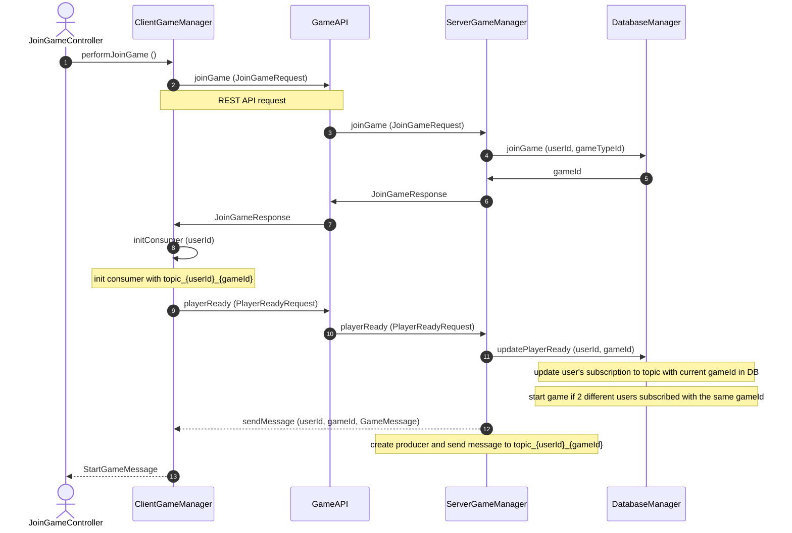

Board Games Server - Battleship & Connect 4
===========================================
Board games implementation in **Java** for Battleship and Connect 4, designated for two players with game results tracking.
<br><br>
<!--
## Table of Contents

- [About the project](#about-the-project)
- [Installation](#installation)
  - [Installation Requirements](#installation-requirements)
  - [Installation Instructions](#installation-instructions)
- [User Manual](#user-manual)
- [Join Game Documentation](#join-game-documentation)
  
&nbsp;

*****
## About the project
-->
Server side:
* RESTful server using **Glassfish application server**
* Receiving **REST API** requests
* Sending messages via **OpenMQ JMS broker** 
* **JDBC** connection to database in **PostgreSQL**
<br>

Client side:
* Sending REST API requests
* Receiving **HTTP** responses
* Receiving messages using JMS API
* UI by using **JavaFX** platform
<br><br>

### System options for logged in user display


### Battleship game display 


### Connect 4 game display 


### Game results tracking display 

<br><br>
*******

Installation
-------------
### Installation Requirements

1) JDK 1.8 version 8.0.202 <br>https://www.oracle.com/il-en/java/technologies/javase/javase8-archive-downloads.html

2) Glassfish 5.0.0 <br>http://download.oracle.com/glassfish/5.0.1/release/java_ee_sdk-8u1.zip	

3) PostgreSQL 14 <br>https://www.enterprisedb.com/downloads/postgres-postgresql-downloads

4) PostgreSQL JDBC Driver 42.4.0 <br>https://jdbc.postgresql.org/download/

5) InteliJ ultimate <br>https://www.jetbrains.com/idea/download/#section=windows

6) Launch4j (optional) - used for creating an exe file to run the client, not from IntelliJ <br>https://sourceforge.net/projects/launch4j/files/launch4j-3/3.14/<br>

► *This application was tested in 1920×1080 display resolution in Windows.* 
<br><br>
*******

### Installation Instructions

&nbsp;
  
#### 1. Set Postgers properties
- Set password to ___password___
- Set username to default (___postgres___)
- Set port to default (___5432___)
<br><br>
  
#### 2. Unpack Glassfish to C drive 
<br>

#### 3. Enable connection to the database
&nbsp;&nbsp;&nbsp;&nbsp;Copy JDBC driver jar file to c:\glassfish5\glassfish\domains\domain1\lib\
<br>

#### 4. Update Glassfish Server Configurations
&nbsp;&nbsp;&nbsp;&nbsp;Overwrite [domain.xml](domain.xml) to c:\glassfish5\glassfish\domains\domain1\config\
<br>

#### 5. Import project in InteliJ and build it
&nbsp;&nbsp;&nbsp;&nbsp;If you have an error "Application Server 'GlassFish 5.0.1' is not configured" in run/debug configurations:<br>
&nbsp;&nbsp;&nbsp;&nbsp;press configure and then add your GlassFish Home directory.<br>
<br>

#### 6. Deploy server
- Deploy server from InteliJ by running “ServerApp” run configuration
- Deploy server from cmd (only after it was deployed at least once by IntelliJ):
    - Run `asadmin start-domain` in your command line from C:\glassfish5\glassfish\bin
    - Go to `localhost:4848` in your web browser, select Applications and then on BoardGamesServer-v1 row select Launch.
<br>

#### 7. Deploy client
- Deploy client from InteliJ by running “ClientApp” run configuration
- Deploy client from cmd:
  - Build artifact clientJavaFXApp
  - You can use Launch4j to create exe file to run the client:
    - Define Output file and Jar
    - Define Min and Max JRE version
    - Select the settings icon for creating the exe
<br><br>
*******

User Manual
------------
### 1. Connection to the System
   * If the server and the client aren't running in the same machine, the following screen will appear: <br><br>
      <br><br>
     There is a message for updating your server URL. All the text fields and buttons are disabled, except the "Settings" button. <br>
     
   * Enter "Settings" will get you to the following screen: </br></br>
      <br><br>
     As a default, the server URL is set to localhost. Update your server name or address in server URL and press "Save". <br>
     You can get your server address by running `ipconfig` in your *command line*. <br>
     If the server and the client are connected to the same WiFi network, get your server address under the section *"Wireless LAN adapter Wifi"* from *"IPv4 Address"*.<br><br> 

### 2. Entering the System <br>
   * If the server URL is provided correctly, the following screen will appear: <br><br>
      <br><br>

     If you're not registered, enter "Sign up" to create your own account: <br><br>
      <br> 

      If the username provided is already exist in the system, you'll get a message.
<br><br>

<!-- * After filling in the details correctly, you will enter your [user account](#system-options-for-logged-in-user-display). <br><br> -->

*******

Join Game Documentation
--------------------------



1. When  user enter "Request to join a new game" button, it triggers an ActionEvent:
   ```java
    @FXML
    public void joinGameButtonPressed(ActionEvent ignoredEvent)
    {
        clientContext.changeScene("join-game.fxml");
    }
   ```
   We load [JoinGameController](BoardGames/BoardGamesClient/src/main/java/client/controllers/JoinGameController.java) from [ClientContext](BoardGames/BoardGamesClient/src/main/java/client/ClientContext.java):
   ```java
      FXMLLoader loader = new FXMLLoader(getClass().getResource(fxmlFile));
      root = loader.load();
      BaseController controller = loader.getController();
      controller.postInit(this);  // pass the context to the next controller
   ```
     Therefore, [performJoinGame()](BoardGames/BoardGamesClient/src/main/java/client/controllers/JoinGameController.java#performJoinGame()) runs from a separate thread.

 2. [ClientGameManager](BoardGames/BoardGamesClient/src/main/java/client/ClientGameManager.java) creates REST API request from [joinGame (JoinGameRequest)](BoardGames/BoardGamesClient/src/main/java/client/ClientGameManager.java#joinGame):
    ```java
    Jsonb jsonb = JsonbBuilder.create();
            HttpResponse<String> apiResponse = Unirest.post(getUrl(/join-game))
                    .header("Content-Type", "application/json")
                    .body(jsonb.toJson(input))
                    .asString();
    ```

3. [GameAPI](BoardGames/BoardGamesServer/src/main/java/com/example/boardgamesserver/GameApi.java) defines the REST API function:
    ```java
      @POST
      @Path(/join-game)  //API endpoint
      @Produces("application/json")
      @Consumes("application/json")
      public JoinGameResponse joinGame(JoinGameRequest input)
    ```
   
4. [DatabaseManager](BoardGames/BoardGamesServer/src/main/java/com/example/boardgamesserver/db/DatabaseManager.java) checks number of users waiting for a game with same gameTypeId in the database **besides the current user**:
   ```java
        String sql = "SELECT g.game_id FROM game g JOIN user_game u ON g.game_id = u.game_id " +
                "WHERE game_type_id = ? AND status = 'WAIT_FOR_ALL_PLAYERS' AND u.user_id <> ? LIMIT 1";
   ```
   If there is no other user waiting for current game type: A new game created in database.
   Otherwise, we change the game status to 'READY_TO_START' in the database.

5. [ClientGameManager](BoardGames/BoardGamesClient/src/main/java/client/ClientGameManager.java) gets gameId as a JoinGameResponse and creates JMSConsumer, subscribed to topic_{gameId}_{userId}.
      ```java
      String topicName = "topic" + this.gameId + "_" + userId;
      Topic topic = this.context.createTopic(topicName);
      this.gameConsumer = context.createConsumer(topic);
      ```

6. [ClientGameManager](BoardGames/BoardGamesClient/src/main/java/client/ClientGameManager.java) sends PlayerReadyRequest including userId and gameId as a REST API request.
   The REST API function playerReady (PlayerReadyRequest), updates user's subscription to topic including userId and gameId in DB.<b>
   By updating this subscription in the database, we allow user to play multiple games simultaneously, so he can create a new topic with different gameId for every game.

7. When two different users created a consumer subscribed to a topic with the same gameId, JMSProducer created in the server. Now the server can interact with the client by sending messages:
     ```java
        String topicName = "topic" + gameId + "_" + userId;
        Topic topic = this.context.createTopic(topicName);
        this.context.createProducer().send(topic, gameMessage);
     ```
